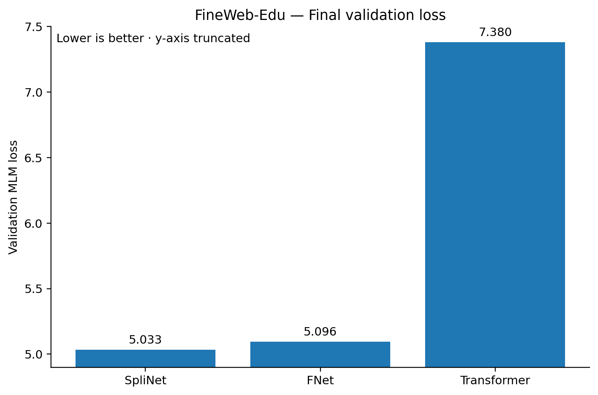
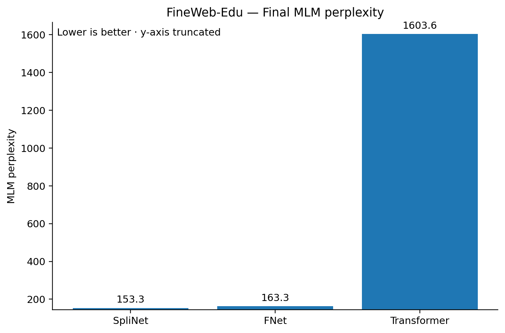
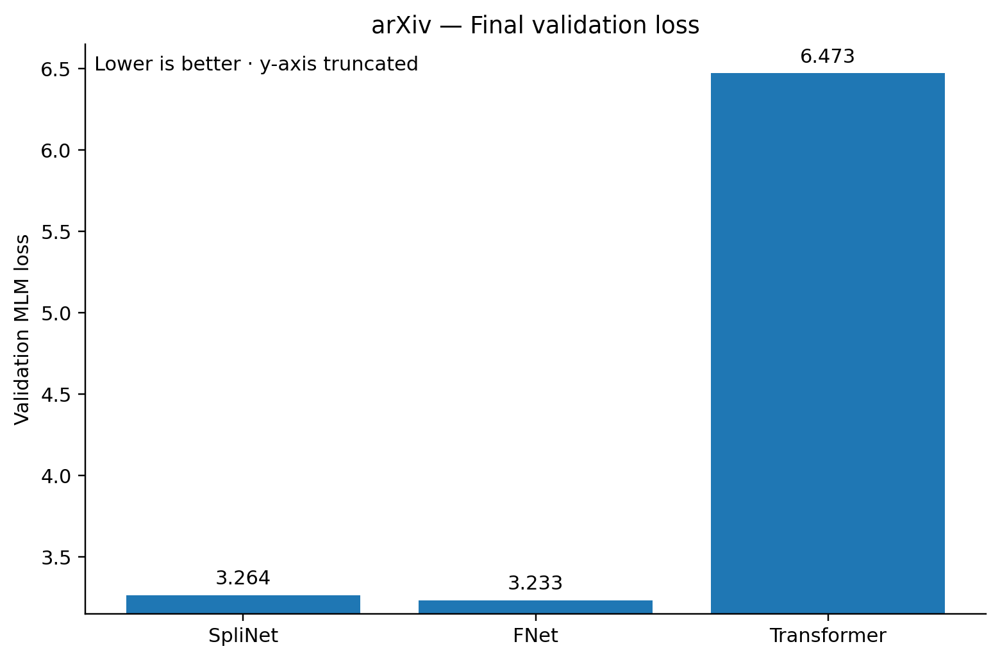
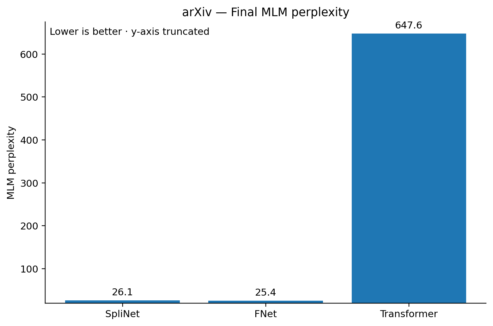
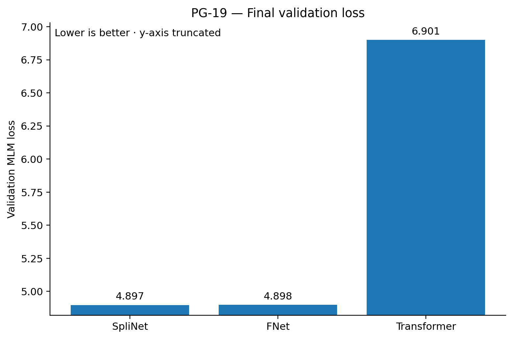
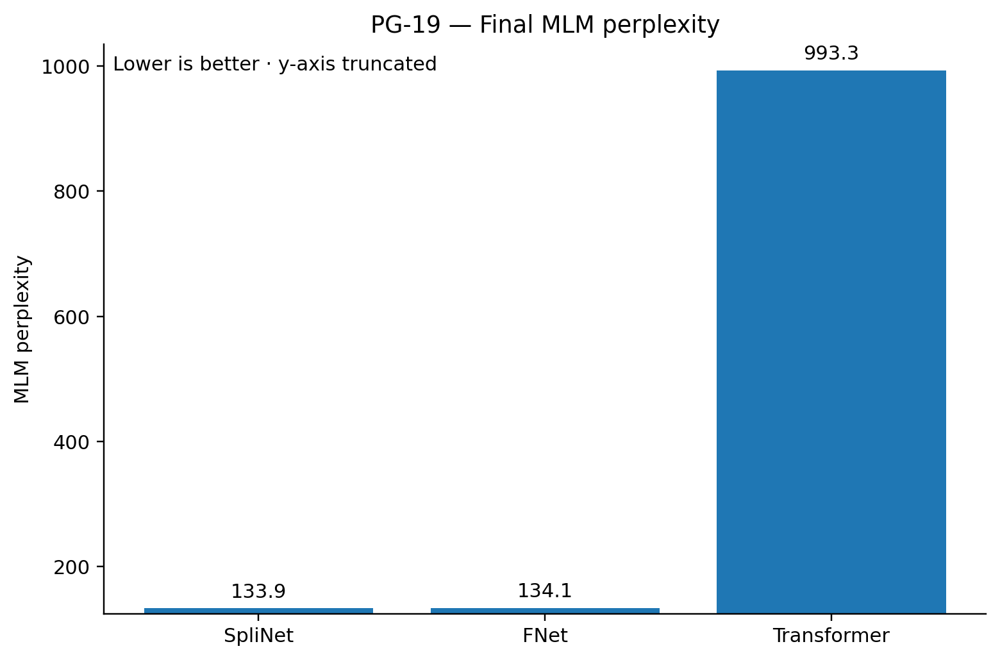
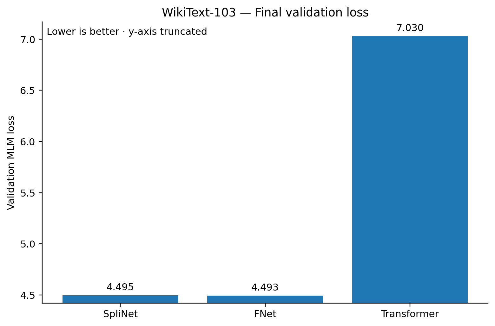
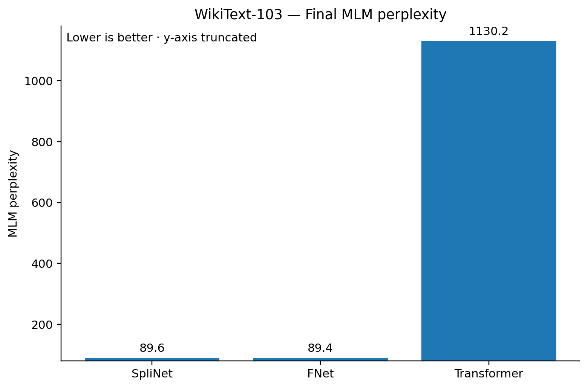

# SpliNet

**SpliNet** is a masked-language-model encoder that replaces attention/Fourier token mixing with a fixed, zero-parameter, multi-head **order-2 single-sided cardinal B-spline mixer**. This repository contains the final selected SpliNet model, matched FNet and regular Transformer baselines, the shared from-scratch tokenizer, reproducibility scripts, evaluation code, checkpoint integrity manifests, and the result figures used in this README.

Only the final SpliNet configuration is exposed here. Historical order/sidedness sweeps are intentionally excluded from the repository and from the reported results.

## What is in the released SpliNet

The released encoder has 12 layers, hidden size 768, 12 heads, head dimension 64, feed-forward width 3072, maximum sequence length 512, and a 32,000-piece vocabulary. The spline mixer is fixed to order 2, single-sided sequence mixing, with radius 16. It contains **zero trainable parameters**: there are no learned query/key/value projections, no attention matrix, no softmax and no learned mixer coefficients.

The rest of the encoder follows the FNet-style scaffold: learned token/position/type embeddings, residual LayerNorm around the mixer, the same feed-forward blocks, and the same masked-language-model head. SpliNet and the matched FNet each have 82,894,592 trainable parameters in the recorded comparison implementation. The regular Transformer baseline has 110,652,416 trainable parameters because of its learned self-attention projections.

The selected spline pole is

```text
z = -3 + 2 sqrt(2)
```

and the truncated inverse-filter kernel is

```text
h[k] = sqrt(2) z^|k|,    |k| <= 16.
```

The sequence mixer reshapes `[B,L,D]` into `[B,H,L,Dh]`, applies the same fixed sequence-axis inverse-spline filter independently to every head/feature signal, then restores `[B,L,D]`. The operation is implemented as reflected padding followed by a single batched `conv1d` over all `B*H*Dh` signals.

A more detailed description is in `docs/ARCHITECTURE.md`.

## Training setup

All models are trained **from scratch**. No pretrained model weights are used. The tokenizer is also trained from scratch: a 32k unigram SentencePiece model fitted to one million lowercased C4 segments. Its SHA256 is

```text
4837a155fbb73b166e8bc58c56a96334342e410af6ec888aeb31a0d620995b48
```

The fixed token IDs are `<unk>=0`, `<s>=1`, `</s>=2`, `<pad>=3`, `[CLS]=4`, `[SEP]=5`, `[MASK]=6`.

Every benchmark uses sequences of length 512 and approximately 99 million training tokens. The common masked-language-model protocol selects 15% of eligible tokens, caps predictions at 80 tokens per sequence, and uses the standard 80/10/10 replacement rule. Adam uses learning rate `1e-4`, betas `(0.9, 0.999)`, epsilon `1e-8`, zero weight decay, and a 1% warmup. The random seed is 2026, the data-order seed is 7301, and the masking seed is 912431.

For matched SpliNet/FNet initialization, every non-mixer SpliNet module is copied exactly from an FNet initialized with the same seed. The SpliNet mixer contributes no trainable parameters.

The four benchmark corpora are FineWeb-Edu (`HuggingFaceFW/fineweb-edu`, `sample-10BT`), arXiv full documents (`ccdv/arxiv-summarization`, `document`), PG-19 (`emozilla/pg19`), and WikiText-103 (`Salesforce/wikitext`, `wikitext-103-raw-v1`). Exact dataset metadata and the recorded training batches are under `configs/`.

## Final results

The figures below report **only the final order-2 single-sided SpliNet**, together with FNet and the regular Transformer. Lower loss and perplexity are better. The vertical axes are intentionally truncated and explicitly marked as such so that differences around the SpliNet/FNet operating point remain visible; the exact numerical values are encoded in `results/final_metrics.json`.

### FineWeb-Edu

SpliNet obtains the lowest final validation loss and perplexity among the three recorded models on FineWeb-Edu.





### arXiv

On arXiv, SpliNet is close to FNet and substantially below the regular Transformer in both loss and perplexity. FNet is slightly lower on this dataset.





### PG-19

On PG-19, SpliNet has the lowest recorded final loss and perplexity, narrowly ahead of FNet and well below the regular Transformer.





### WikiText-103

On WikiText-103, SpliNet and FNet are very close; FNet is slightly lower, while both are far below the regular Transformer under the matched training budget.





## Repository layout

The implementation is split into a small public SpliNet package, baseline implementations, scripts, configuration files, result artifacts and reproducibility notebooks.

```text
splinet/
    configuration_splinet.py
    core.py
    mixer.py
    modeling_splinet.py
    checkpoint.py
    tokenization.py
    builders.py
    mlm.py

baselines/
    fnet.py
    transformer.py

scripts/
    train_tokenizer.py
    materialize_dataset.py
    train_mlm.py
    evaluate_checkpoint.py
    verify_checkpoint_archives.py
    extract_checkpoint_archive.py
    plot_results.py

configs/
    splinet_order2_single.json
    datasets.json
    training_fineweb_edu.json
    training_arxiv.json
    training_pg19.json
    training_wikitext103.json

tokenizer/
    spiece.model
    spiece.vocab
    tokenizer_metadata.json

results/
    final_metrics.json

artifacts/
    checkpoint_manifest.json
    checkpoint_state_schema.json

assets/plots/
    README result figures

notebooks/
    one reproduction notebook per benchmark
```

There are deliberately **no hidden dotfiles or dot-directories** in the repository.

## Installation

Create a fresh Python environment and install the repository dependencies:

```bash
pip install -r requirements.txt
pip install -e .
```

The recorded environment used `transformers==5.17.0`, `datasets==5.0.1`, `accelerate==1.15.0`, and `sentencepiece==0.2.2`. The FineWeb-Edu runs were recorded on a Tesla T4 using AMP FP16, with FNet FFTs promoted to FP32. The arXiv, PG-19 and WikiText-103 runs were recorded on an NVIDIA RTX PRO 6000 Blackwell Server Edition using BF16.

## Loading SpliNet

Construct the final architecture with the repository builder:

```python
from splinet.builders import build_splinet

model = build_splinet(matched_to_fnet=False)
```

To load one of the released training checkpoints:

```python
from splinet.builders import build_splinet
from splinet.checkpoint import load_splinet_checkpoint

model = build_splinet(matched_to_fnet=False)
payload, incompatible = load_splinet_checkpoint(
    model,
    "trained_model_final.pt",
    strict=True,
)
model.eval()
```

The checkpoint loader transparently remaps the pre-release base-model prefix used inside the stored state dictionaries to the public `splinet` prefix. No learned tensor is altered.

## Recreating the tokenizer

The released tokenizer is already included under `tokenizer/`. To rebuild it from the pinned C4 source:

```bash
python scripts/train_tokenizer.py --output-dir tokenizer_rebuilt
```

The rebuilt model should be checked against the expected tokenizer SHA256 before being used for an exact reproduction.

## Materializing a benchmark

For example, to create the FineWeb-Edu token blocks:

```bash
python scripts/materialize_dataset.py \
  --dataset fineweb_edu \
  --tokenizer tokenizer/spiece.model \
  --output-dir data/fineweb_edu
```

Replace `fineweb_edu` with `arxiv`, `pg19`, or `wikitext103` for the other corpora. The materializer writes `train_blocks.npy`, `validation_blocks.npy` and a completion manifest.

## Training the final SpliNet

The FineWeb-Edu recorded batch configuration can be reproduced with:

```bash
python scripts/train_mlm.py \
  --model splinet \
  --dataset-name FineWeb-Edu \
  --data-dir data/fineweb_edu \
  --output-dir runs/fineweb_edu/splinet \
  --effective-batch 64 \
  --micro-batch 16
```

For the large-GPU arXiv, PG-19 and WikiText-103 runs, the recorded SpliNet configuration used effective batch 128 and physical micro-batch 32. The exact recorded settings are in `configs/training_*.json`.

The same script trains the two baselines by changing `--model` to `fnet` or `transformer`. This keeps the tokenizer, data blocks, masking protocol, optimizer, seed, training-token budget and evaluation path common.

## Evaluating a checkpoint

```bash
python scripts/evaluate_checkpoint.py \
  --model splinet \
  --checkpoint trained_model_final.pt \
  --validation data/fineweb_edu/validation_blocks.npy
```

The same evaluator accepts `--model fnet` and `--model transformer` for the baseline checkpoint formats.

## Checkpoint release assets

The twelve trained checkpoint ZIP files are not embedded in the Git repository because each archive is approximately 300–407 MB, above GitHub's normal source-control per-file limit. They are intended to be attached as GitHub Release assets.

The release set contains exactly three models for each of the four corpora: final SpliNet order-2 single-sided, FNet, and the regular Transformer. `artifacts/checkpoint_manifest.json` records both the ZIP SHA256 and extracted `.pt` SHA256 for every file. `artifacts/checkpoint_state_schema.json` records the state-dict tensor names/shapes without carrying the large tensors themselves.

Before publishing or using a release directory, verify it with:

```bash
python scripts/verify_checkpoint_archives.py /path/to/checkpoint_zips
```

See `docs/CHECKPOINTS.md` for the extraction and verification workflow.

## Hugging Face export

After extracting a SpliNet checkpoint, export it to a standard Transformers directory with safetensors:

```bash
python huggingface/export_splinet.py \
  trained_model_final.pt \
  --tokenizer-dir tokenizer \
  --output-dir hf_splinet
```

The exporter deliberately targets only the final SpliNet architecture in this repository.

## Regenerating the figures

The README figures can be regenerated directly from the curated final metrics:

```bash
python scripts/plot_results.py
```

The plotting script reproduces the explicitly truncated y-axis ranges used in the README.

## Integrity and provenance

The repository's result numbers and checkpoint metadata are derived from the completed run manifests and the final checkpoint audit. The 12 final checkpoints were independently hashed. The checkpoint state audit confirms 110 stored tensors for each SpliNet/FNet final checkpoint and 155 stored tensors for each regular Transformer final checkpoint. Because tied/shared weights can appear more than once in a state dictionary, stored state-dict element counts should not be interpreted as the trainable-parameter count.

For the full reproduction rationale, see `docs/REPRODUCIBILITY.md`.

## Scope

This repository intentionally contains no Mamba, Mamba-2, Hyena, RetNet, or historical SpliNet order/sidedness sweep artifacts. The public scope is the selected SpliNet order-2 single-sided model and its two matched baselines only.
